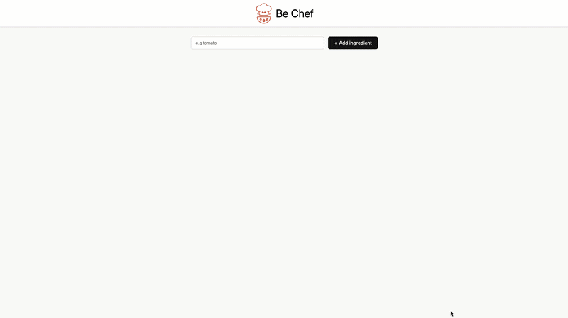

# 🍳 Be Chef

> **Turn your available ingredients into delicious recipes — powered by AI.**

Be Chef is a React web application that lets you add ingredients you have on hand and instantly generates a personalized recipe using the **Cohere Command R+** AI model. No more wondering what to cook — just tell Be Chef what's in your kitchen!

---

## ✨ Features

- **Ingredient Manager** — Add ingredients one by one to build your pantry list
- **AI-Powered Recipe Generation** — Once you have 4+ ingredients, get a full recipe generated by Cohere's `command-r-plus` LLM
- **Smooth UX** — Auto-scrolls to the recipe section when it's ready
- **Loading & Error States** — Clear feedback while the AI is thinking or if something goes wrong
- **Clean Minimal UI** — Simple, distraction-free design focused on the cooking experience

---

## 🖥️ Demo



---

## 🛠️ Tech Stack

| Technology | Purpose |
|---|---|
| **React 18** | UI framework |
| **Vite** | Build tool & dev server |
| **Cohere API** (`command-r-plus-08-2024`) | AI recipe generation |
| **CSS (custom)** | Styling |

---

## 📁 Project Structure

```
Be-Chef/
├── src/
│   ├── component/
│   │   ├── beChefrecipe.jsx     # Displays the AI-generated recipe
│   │   └── ingredientList.jsx   # Lists ingredients & triggers recipe fetch
│   ├── assets/
│   │   └── logo.png
│   ├── App.jsx                  # Root component
│   ├── Header.jsx               # Top navigation bar
│   ├── Main.jsx                 # Core logic & state management
│   ├── ai.js                    # Cohere API integration
│   ├── index.jsx                # App entry point
│   └── index.css                # Global styles
├── .env                         # Environment variables (not committed)
├── package.json
└── README.md
```

---

## 🚀 Getting Started

### Prerequisites

- [Node.js](https://nodejs.org/) (v18 or higher recommended)
- A free [Cohere API Key](https://dashboard.cohere.com/)

### Installation

1. **Clone the repository**
   ```bash
   git clone https://github.com/akshad-3/Mini-Projects.git
   cd Mini-Projects/React/Be-Chef
   ```

2. **Install dependencies**
   ```bash
   npm install
   ```

3. **Set up environment variables**

   Create a `.env` file in the project root:
   ```env
   VITE_COHERE_API_KEY=your_cohere_api_key_here
   ```

4. **Start the development server**
   ```bash
   npm run dev
   ```

5. Open [http://localhost:5173](http://localhost:5173) in your browser.

---

## 🔑 Environment Variables

| Variable | Description |
|---|---|
| `VITE_COHERE_API_KEY` | Your Cohere API key from [dashboard.cohere.com](https://dashboard.cohere.com) |

> ⚠️ Never commit your `.env` file. Make sure it's listed in `.gitignore`.

---

## 📖 How It Works

1. Type an ingredient into the input box and click **"Add ingredient"**
2. Repeat until you have **at least 4 ingredients**
3. A prompt box appears — click **"Get a recipe"**
4. Be Chef sends your ingredients to the **Cohere Command R+** model
5. A formatted recipe appears with ingredients and step-by-step instructions
6. The page smoothly scrolls to your recipe

---

## 🤝 Contributing

Contributions are welcome! Feel free to:

- Open an issue for bugs or feature requests
- Fork the repo and submit a pull request

```bash
# Fork → Clone → Create a branch → Make changes → Push → Open PR
git checkout -b feature/your-feature-name
```
---

## 👨‍💻 Author

**Akshad** — [@akshad-3](https://github.com/akshad-3)

---

> 💡 *Part of the [Mini-Projects](https://github.com/akshad-3/Mini-Projects) collection — a showcase of React mini-apps.*
