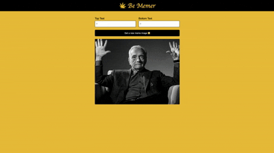

# 🍃 Be Memer

A fun and interactive meme generator built with **React**. Users can add custom top and bottom text to randomly fetched meme templates from the internet and generate unique memes on the fly.

---

## 📸 Preview


---

## 🚀 Features

- Fetches 100+ real meme templates from the [Imgflip API](https://api.imgflip.com/)
- Randomly cycles through meme images with one click
- Live top and bottom text overlay with classic meme typography (Impact font)
- Clean, responsive layout with a max-width of 600px
- Minimal and intuitive UI

---

## 🛠️ Tech Stack

| Technology | Purpose |
|---|---|
| React 18 | UI framework |
| Vite | Build tool & dev server |
| CSS3 | Styling & layout |
| Imgflip API | Meme image source |

---

## 📁 Project Structure

```
be-memer/
├── public/
├── src/
│   ├── assets/
│   │   └── leaf.png          # App logo
│   ├── components/
│   │   ├── Header.jsx        # App header with logo and title
│   │   └── Main.jsx          # Core meme generator logic & UI
│   ├── App.jsx               # Root component
│   ├── index.jsx             # React DOM entry point
│   └── index.css             # Global styles
├── index.html
├── package.json
└── README.md
```

---

## ⚙️ Getting Started

### Prerequisites

- [Node.js](https://nodejs.org/) v18 or higher
- npm or yarn

### Installation

1. **Clone the repository**

   ```bash
   git clone https://github.com/your-username/be-memer.git
   cd be-memer
   ```

2. **Install dependencies**

   ```bash
   npm install
   ```

3. **Start the development server**

   ```bash
   npm run dev
   ```

4. **Open your browser** and navigate to `http://localhost:5173`

### Build for Production

```bash
npm run build
```

The optimized output will be in the `dist/` folder.

---

## 🔌 API Reference

This project uses the free [Imgflip API](https://api.imgflip.com/).

| Endpoint | Method | Description |
|---|---|---|
| `https://api.imgflip.com/get_memes` | GET | Returns a list of popular meme templates |

No API key is required for fetching meme templates.

---

## 🧩 Component Overview

### `App.jsx`
The root component that composes `Header` and `Main`.

### `Header.jsx`
Displays the app logo and title ("Be Memer") in a styled black navigation bar.

### `Main.jsx`
The core component responsible for:
- Fetching meme data on mount via `useEffect`
- Managing meme state (`topText`, `bottomText`, `imageUrl`) via `useState`
- Handling text input changes through a unified `handleChange` handler
- Randomly selecting a new meme image on button click

---

## 📦 Dependencies

```json
{
  "react": "^18.x",
  "react-dom": "^18.x"
}
```

Install a font from Google Fonts if using the **Karla** typeface:

```html
<link href="https://fonts.googleapis.com/css2?family=Karla&display=swap" rel="stylesheet" />
```

---

## 🤝 Contributing

Contributions are welcome! To contribute:

1. Fork the repository
2. Create a new branch: `git checkout -b feature/your-feature-name`
3. Commit your changes: `git commit -m 'Add some feature'`
4. Push to the branch: `git push origin feature/your-feature-name`
5. Open a Pull Request

---

## 📄 License

This project is licensed under the [MIT License](LICENSE).

---

## 👤 Author

**Your Name**
- GitHub: [@your-username](https://github.com/your-username)
- Portfolio: [yourportfolio.com](https://yourportfolio.com)

---

> Built with ❤️ using React
