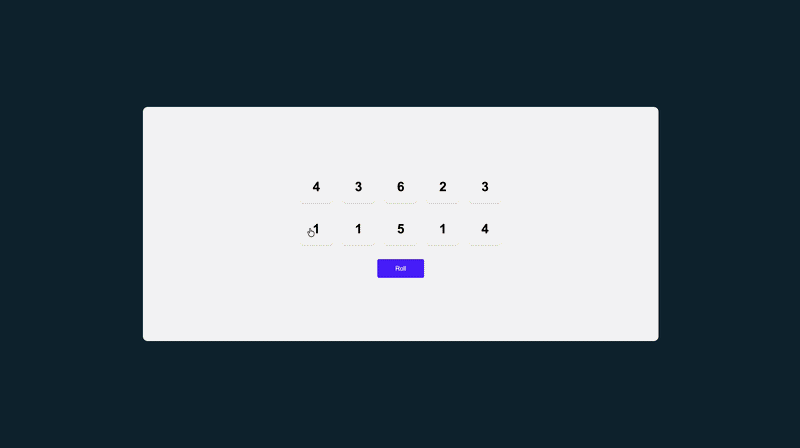

# 🎲 Tenzies

A fast-paced dice game built with **React**. Roll the dice, hold the ones you want to keep, and try to get all ten dice showing the same number. First to match all ten wins — with a confetti celebration!

---

## 📸 Preview


---

## 🎮 How to Play

1. Press **Roll** to roll all ten dice
2. Click any die to **hold** it (it turns green 🟢)
3. Keep rolling — held dice stay in place
4. Win when **all ten dice show the same number**
5. Celebrate 🎉 then press **New Game** to play again

---

## 🚀 Features

- 10 interactive dice with hold/release toggling
- Win detection — checks all dice are held and equal
- Confetti animation on game completion via `react-confetti`
- Auto-focus on the action button when the game is won (keyboard accessible)
- Unique IDs per die using `nanoid` for stable React keys
- Clean dark-themed UI with a light game board

---

## 🛠️ Tech Stack

| Technology | Purpose |
|---|---|
| React 18 | UI framework |
| Vite | Build tool & dev server |
| nanoid | Unique ID generation for dice |
| react-confetti | Win celebration animation |
| CSS3 | Styling & layout |

---

## 📁 Project Structure

```
tenzies/
├── public/
├── src/
│   ├── component/
│   │   └── die.jsx         # Individual die button component
│   ├── App.jsx             # Root component
│   ├── main.jsx            # Core game logic (state, win detection, roll)
│   ├── index.jsx           # React DOM entry point
│   └── index.css           # Global styles
├── index.html
├── package.json
└── README.md
```

---

## ⚙️ Getting Started

### Prerequisites

- [Node.js](https://nodejs.org/) v18 or higher
- npm or yarn

### Installation

1. **Clone the repository**

   ```bash
   git clone https://github.com/your-username/tenzies.git
   cd tenzies
   ```

2. **Install dependencies**

   ```bash
   npm install
   ```

3. **Start the development server**

   ```bash
   npm run dev
   ```

4. **Open your browser** and navigate to `http://localhost:5173`

### Build for Production

```bash
npm run build
```

The optimized output will be in the `dist/` folder.

---

## 📦 Dependencies

```json
{
  "react": "^18.x",
  "react-dom": "^18.x",
  "nanoid": "^5.x",
  "react-confetti": "^6.x"
}
```

Install them manually if needed:

```bash
npm install nanoid react-confetti
```

---

## 🧩 Component Overview

### `App.jsx`
Root component — renders the `Main` game component.

### `main.jsx`
The core game engine. Responsibilities include:
- Initializing 10 dice with random values using `generateAllNewDice()`
- Tracking held state per die via `useState`
- Detecting a win condition with `.every()` checks across the dice array
- Auto-focusing the Roll/New Game button on win via `useRef` + `useEffect`
- Rendering the `Die` grid and the action button

### `die.jsx`
A single die rendered as a `<button>`. Turns **green** when held (`isHeld: true`). Clicking calls the `hold(id)` function passed down as a prop.

---

## ♿ Accessibility

- The Roll / New Game button receives automatic focus when the game is won, allowing keyboard-only players to continue without using a mouse
- Die buttons are native `<button>` elements, fully keyboard and screen-reader accessible

---

## 🤝 Contributing

Contributions are welcome! To contribute:

1. Fork the repository
2. Create a new branch: `git checkout -b feature/your-feature-name`
3. Commit your changes: `git commit -m 'Add some feature'`
4. Push to the branch: `git push origin feature/your-feature-name`
5. Open a Pull Request

---

## 👤 Author

**Your Name**
- GitHub: [@your-username](https://github.com/akshad-3)
---

> Built with ❤️ using React
