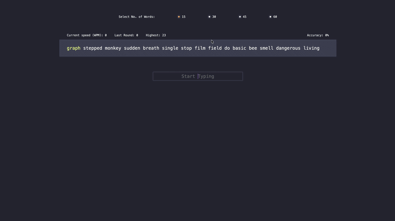

# Typing Speed Test App

A responsive Typing Speed Test application built with React and Vite. It allows users to measure typing speed (WPM) and accuracy in real time with a clean and minimal interface.

---
## Demo



---

## Features

* Real-time typing speed calculation (WPM)
* Accuracy tracking
* Random word generation
* Fast performance using Vite
* Clean and minimal UI

---

## Tech Stack

* React.js
* Vite
* JavaScript (ES6+)
* CSS3

---

## Project Structure

```
src/
│── component/
│   ├── Nav.jsx
│   ├── Home.jsx
│   └── App.jsx
│── data.js
│── index.jsx
│── index.css
```

---

## Installation & Setup

Clone the repository:

```
git clone https://github.com/your-username/your-repo-name.git
```

Navigate to the project directory:

```
cd your-repo-name
```

Install dependencies:

```
npm install
```

Start the development server:

```
npm run dev
```

---

## Live Demo


---

## Future Improvements

* Add difficulty levels
* Add timer-based modes
* Store high scores
* Improve UI/UX

---

## Author

Your Name
GitHub: https://github.com/akshad-3
